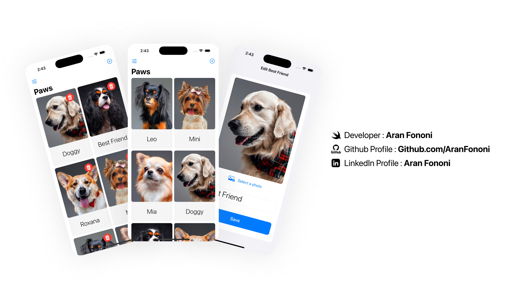

# Paws 🐾  

### A simple and beautiful way to manage your pets  

Paws is a SwiftUI app that lets you add, edit, and organize your pets with ease. Whether it’s a cat, dog, or any furry (or not-so-furry) friend, you can keep track of them effortlessly.  

This project was built as part of **Section 8 of the Udemy SwiftUI MasterClass**.  

## 📌 Project Overview  
This app allows users to **add and manage pets** in a clean and minimal interface. It uses **SwiftData** for persistence and **SwiftUI** for a smooth and modern look.  

## 🚀 What I Focused On  
- **SwiftData Integration:** Used Swift’s built-in data framework for easy storage.  
- **Smooth Animations:** Added subtle animations for a polished feel.  
- **Minimal UI:** Designed a clean and distraction-free interface.  
- **Navigation & Editing:** Pets can be added, viewed, and deleted with ease.  

## 🔥 Features  
✅ Add and manage pet profiles  
✅ Upload pet photos  
✅ Simple and elegant grid layout  
✅ Data is saved automatically using SwiftData  

---

## 📸 Screenshot  
  

---

## 🛠️ How to Use  
1. Clone this repository.  
2. Open the project in Xcode (iOS 17+ recommended).  
3. Run the app on a simulator or device.  

---

## 📬 Contact  
For any questions or collaborations, feel free to reach out:  
- **Email**: [aranfononi@gmail.com](mailto:aranfononi@gmail.com)  
